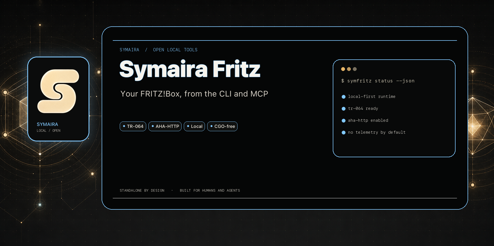
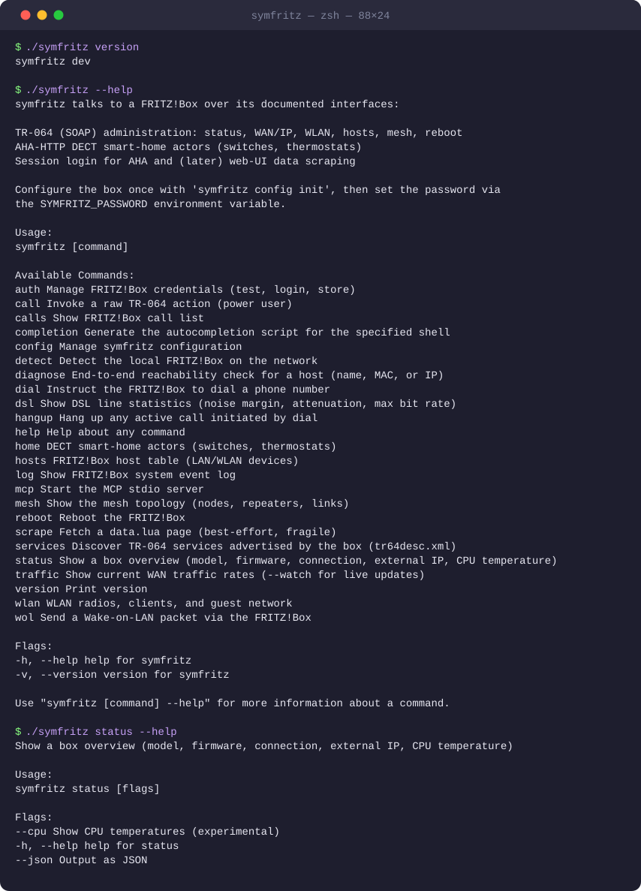

# Symaira Fritz

[](https://github.com/danieljustus/symaira-fritz/actions/workflows/ci.yml)
[](https://github.com/danieljustus/symaira-fritz/releases/latest)
[](LICENSE)
[](rust-toolchain.toml)



> A CLI to **administer, analyse, and control an AVM FRITZ!Box** — part of the
> Symaira ecosystem. Binary name: `symfritz`.

**Status:** Active development — see the [latest releases](https://github.com/danieljustus/symaira-fritz/releases).

## Demo



## Why symfritz

- **Single binary, no dependencies** — works on macOS, Linux, and Windows
- **Speaks documented interfaces only** (TR-064, AHA-HTTP) — no reverse-engineering required
- **End-to-end diagnosis in one command** — `symfritz diagnose <host>` checks box entry, activity, LAN/WLAN, DNS, and TCP ports
- **Secure credential handling** — resolves from env, symvault, or macOS Keychain; never stores plaintext by default
- **MCP server for AI agents** — exposes all capabilities as a stdio MCP server

It speaks the FRITZ!Box's documented interfaces, no reverse-engineering required:

| Interface | Used for | Endpoint |
|-----------|----------|----------|
| **TR-064** (SOAP) | Administration: status, WAN/IP, WLAN, host list, mesh, reboot | `:49443` (TLS default) / `:49000` |
| **AHA-HTTP** | DECT smart-home actors (switches, thermostats) | `/webservices/homeautoswitch.lua` |
| **Session login** | Auth for AHA and best-effort web-UI scraping | `/login_sid.lua` |

> Inspired by [`fritzconnection`](https://github.com/kbr/fritzconnection) (Python,
> the best TR-064 reference) and [`fritzctl`](https://github.com/bpicode/fritzctl)
> (Go, the architectural blueprint).

## Capabilities

- **Session auth** — modern PBKDF2 (FRITZ!OS 7.24+) *and* legacy MD5 challenge-response, with automatic re-login on session expiry.
- **TR-064** — generic action calls with HTTP digest auth, plus `tr64desc.xml` service discovery (`symfritz services`).
- **Hosts** — first-class host table: `list`, `active`, `get` by name/MAC/IP.
- **Detect** — find FRITZ!Box on local network when `fritz.box` resolves to a public IP.
- **Diagnose** — end-to-end host reachability (box entry → active → LAN/WLAN → DNS → TCP ports).
- **Doctor** — validate the local config, credential resolution, TR-064 discovery, session login, and optional AHA access.
- **Mesh** — topology of nodes, repeaters, and links.
- **WLAN** — radios, associated clients, guest-network status/toggle.
- **Wake-on-LAN** — by host name/IP or explicit MAC.
- **AHA-HTTP** — DECT device listing, switch on/off, and thermostat temperature control (`symfritz home`).
- **Credentials** — `auth login/test/store`, resolved from env → symvault → macOS Keychain → config.
- **Traffic** — current WAN traffic rates (downstream/upstream by category); use `symfritz traffic --watch` for live monitoring.
- **DSL** — line statistics: noise margin, attenuation, max bit rate.
- **Phone** — call list with type filtering, dial, and hangup.
- **Log** — system event log with category filtering (sys/net/fon/wlan/usb).
- **`status`**, **`reboot`**, an **MCP server** (stdio) exposing the above, config + env loading.
- Global `--output text|json|yaml` for structured output; `--json` remains the shorthand on the root and existing subcommands.

Still planned: per-radio band labelling.

## Install

```bash
make build           # → ./symfritz
# or
cargo install --path crates/symfritz-cli --locked
# or via Homebrew
brew install danieljustus/tap/symfritz
```

## Configure

```bash
symfritz config init                       # writes ~/.config/symfritz/config.toml
# edit host/user in the file, then store the password securely:
symfritz auth login                        # prompts, verifies against the box, stores it
symfritz auth test                         # confirm it resolves and works
```

`config init` is intentionally a subcommand rather than a top-level `init`: symfritz
has one local configuration file and no other initialization state.

### Where the password comes from

symfritz resolves the password at runtime, in this order (first hit wins):

1. **`SYMFRITZ_PASSWORD`** environment variable — ad-hoc / CI.
2. **symvault** — set `password_ref = "fritz.password"` in the config; symfritz
   shells out to `symvault get` so nothing is stored on disk.
3. **macOS Keychain** — set `keychain = true`; service `symfritz`, account = host.
4. **`password`** plaintext in the config — least secure, convenience only.

`auth login` captures the password once, verifies it, and stores it in the
Keychain (default on macOS) or symvault (`--symvault fritz.password`). symvault
and the Keychain are reached through their CLIs, so symfritz has **no build
dependency** on either and works fine when they are absent.

```bash
symfritz auth login --symvault fritz.password   # store in symvault instead of Keychain
symfritz auth store --keychain                  # store without verifying (reads SYMFRITZ_PASSWORD or prompts)
symfritz auth test                              # show source + verify web login and TR-064 access
```

> **Tip:** use a dedicated FRITZ!Box user with only the permissions you need
> rather than the admin account. TR-064 must be enabled on the box
> (Home Network → Network → Network Settings → "Allow access for applications").

### Debug logging

For troubleshooting or attaching detailed diagnostics to a bug report, enable debug logging by setting the `SYMFRITZ_LOG_LEVEL=debug` environment variable:

```bash
SYMFRITZ_LOG_LEVEL=debug symfritz doctor
```

This emits request-level logs (method, redacted URL, and status code) for TR-064, session login, and service discovery requests while keeping credentials, passwords, and session IDs redacted.

### TLS & Certificate Pinning

TLS is enabled by default (`use_tls = true`), connecting to port 49443 (TR-064)
and port 443 (web login). On first connection, symfritz records the box's
certificate public key pin (TOFU) in `~/.config/symfritz/pins.json` and verifies
it on subsequent calls.

- If TLS endpoints do not answer (e.g. TR-064 TLS is disabled on the box), symfritz
  automatically falls back to plain HTTP and emits a warning naming `use_tls`.
- Set `use_tls = false` in `~/.config/symfritz/config.toml` to disable TLS entirely.
- Set `insecure_tls = true` to skip certificate verification without pinning.
- Use `symfritz auth trust --reset <host>` to reset a recorded certificate pin.

## Usage

For the complete list of commands, subcommands, and flags, see the [CLI Command Reference](docs/cli.md).

### Common commands

```bash
symfritz status                             # model, firmware, connection, external IP
symfritz detect                             # find FRITZ!Box on local network
symfritz diagnose macmini                   # end-to-end host reachability check
symfritz diagnose router                    # detect and diagnose local router
symfritz doctor                             # verify the local setup and box access
symfritz hosts list                         # all known network devices
symfritz wlan radios                        # WLAN SSIDs, channels, state
symfritz traffic                            # current WAN traffic rates
symfritz traffic --watch --interval 5s       # live WAN traffic monitoring
symfritz dsl                                # DSL line statistics
symfritz home list                          # DECT smart-home actors
symfritz home temp <ain> <celsius|on|off>   # set target temperature for thermostat
symfritz calls                              # recent call list
symfritz status --output json                # machine-readable status
symfritz reboot --yes                       # reboot the FRITZ!Box
symfritz mcp                                # start MCP stdio server for AI agents
```

### Typical Mac Mini check

```bash
symfritz diagnose macmini
# Diagnose macmini  →  192.168.188.65
#   ✓ FRITZ!Box knows host       macmini
#   ✓ Host active
#   ✓ IP address                 192.168.188.65
#   ✓ Link medium                LAN
#   ✓ DNS resolves               192.168.188.65
#   ✓ TCP 22 (SSH)               open
#   ✗ TCP 5900 (VNC/Screen Sharing)  closed or filtered
#   ✓ TCP 8001 (Paperless)       open
```

### Raw TR-064 service names

Shortcuts: `deviceinfo`, `wanip`, `wanppp`, `wancommon`, `hosts`, `wlan1`. Any
other name is resolved through `tr64desc.xml` discovery, so `call` reaches every
action the box advertises.

## MCP server

`symfritz mcp` starts a stdio MCP server that exposes the FRITZ!Box capabilities
to AI agents such as Hermes.

### Registering in Hermes

Add a server block to your Hermes configuration. The example below assumes the
Homebrew-installed binary at `/opt/homebrew/bin/symfritz`; adjust the path to
your installation:

```yaml
mcp_servers:
  symfritz:
    command: /opt/homebrew/bin/symfritz
    args:
      - mcp
    env:
      SYMFRITZ_HOST: "192.168.188.1"
    enabled: true
```

> **Note:** `fritz.box` can resolve to a public IP address on some networks, which
> causes the MCP server to fail to reach the box. Use an explicit local IP or a
> DNS name you control, and set it via `SYMFRITZ_HOST` or `host` in the config.

### Smoke test

After registering, verify the server starts and exposes the expected tools:

```bash
$ SYMFRITZ_HOST=192.168.188.1 symfritz mcp
initialize: OK
serverInfo.name: symfritz
serverInfo.version: <version>
tools/list: 9 tools
```

The expected tools are `status`, `host_list`, `host_get`, `diagnose`, `mesh`,
`wlan_clients`, `wake_on_lan`, `home_list`, and `home_switch`.

## Ecosystem

Symaira Fritz is part of the [Symaira ecosystem](https://symaira.com). It can
use [symvault](https://github.com/danieljustus/symaira-vault) as an optional
credential store and exposes its capabilities to [Hermes Agent](https://hermes-agent.nousresearch.com/)
through MCP.

## Architecture

```
crates/symfritz-cli/    clap CLI and output adapters
crates/symfritz-core/   config, credentials, auth primitives, TLS pins
crates/symfritz-tr064/  SOAP/digest transport, discovery, typed capabilities
crates/symfritz-aha/    session-authenticated AHA and web endpoints
crates/symfritz-mcp/    MCP stdio server and protocol framing
cmd/ + internal/        Go oracle and rollback implementation during v0.7
```

The Rust crates are the production implementation. The Go packages remain
runnable as the differential oracle and `symfritz-go` rollback during the
first stable Rust release window.

## Caveats

- TR-064 + AHA cover the stable ~80%. For remaining data such as some stats,
  logs, and guest-WLAN details, the best-effort `symfritz scrape` command uses
  the web-UI `data.lua` endpoint. That interface is FRITZ!OS-version-dependent
  and may break on firmware updates; prefer TR-064 or AHA whenever possible.

## Upgrade and rollback during the Rust cutover

Prereleases and the first stable Rust release ship both executables in every
archive: `symfritz` is the Rust primary and `symfritz-go` is the last known-good
Go fallback. Keep the existing `~/.config/symfritz/config.toml` and
`~/.config/symfritz/pins.json` when upgrading; the Rust snapshot gate compares
both config-init bytes and preserves the Go-compatible SPKI pin format.

Verify an upgrade with:

```bash
symfritz version --json
symfritz-go version --json       # fallback remains available
```

If parity, router smoke, or the value gate fails, invoke `symfritz-go` directly
and keep the same config and pin files. Do not delete or reset pins as part of
rollback. Go source and the fallback archive member are removed only in a
separate reviewed change after one stable Rust release has no unexplained
parity defects. See [`docs/rust-port/release-cutover.md`](docs/rust-port/release-cutover.md)
for the release, signing, SBOM, and live-smoke gates.

## Development

Rust has been the released primary implementation since v0.7.0. The completed
parity evidence and temporary Go rollback lifecycle are documented in
[`docs/rust-port/`](docs/rust-port/).

Build:

```bash
make build           # → ./symfritz
make build-go        # → target/debug/symfritz-go (oracle/fallback)
```

Test:

```bash
make test            # Rust workspace + Go oracle
make rust-test
make go-test
```

Lint:

```bash
make lint            # rustfmt + Clippy + Go fmt/vet
make rust-lint
make go-lint
```

See [CONTRIBUTING.md](CONTRIBUTING.md) for the full contribution guide.

## License

Apache-2.0. See [LICENSE](LICENSE).
